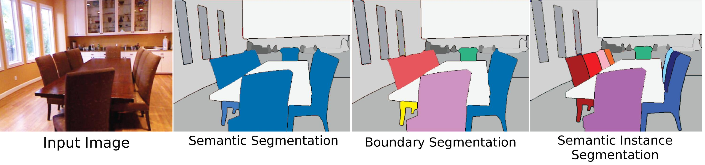
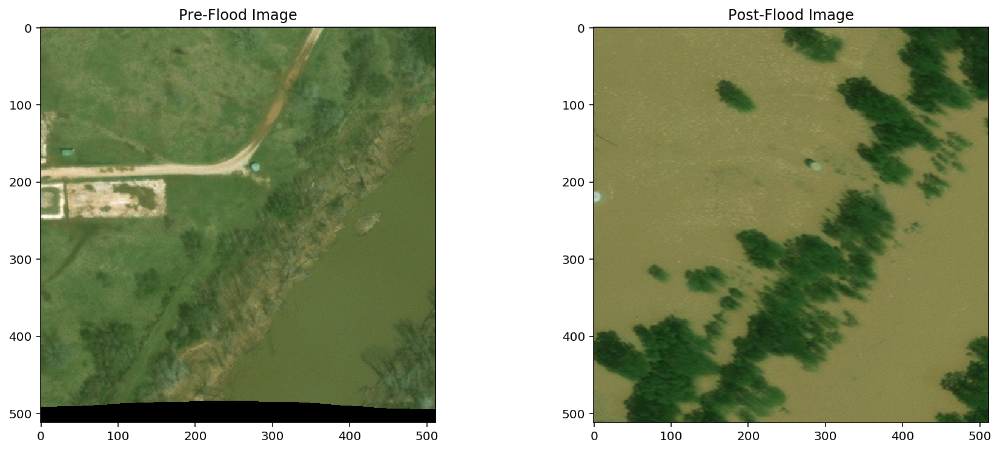
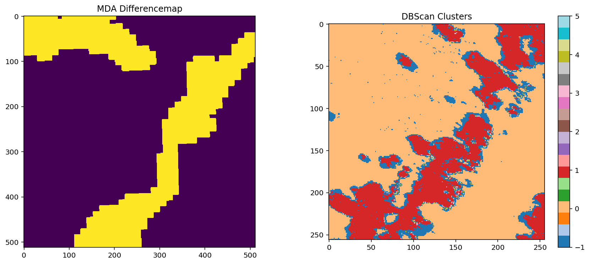
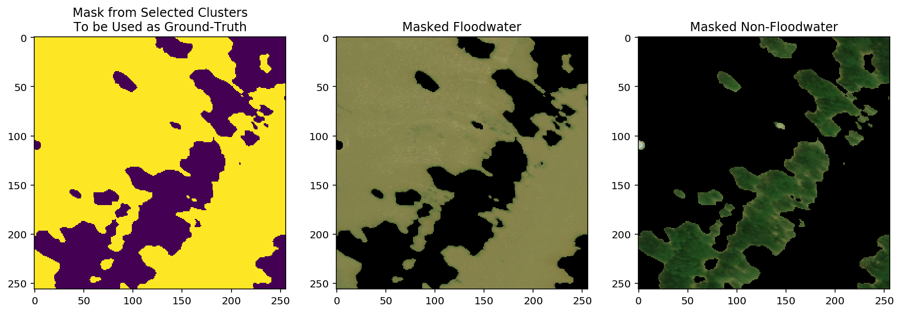
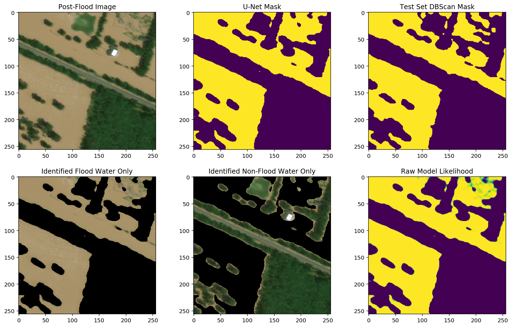
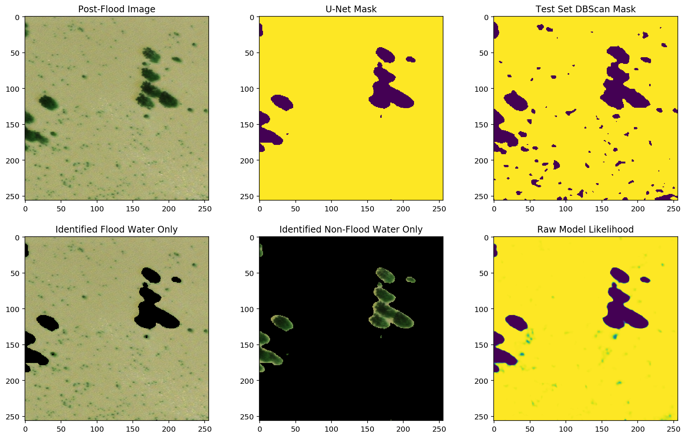
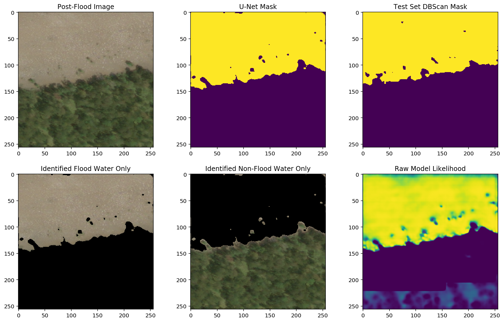
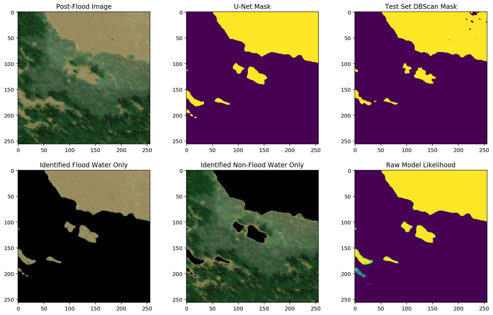
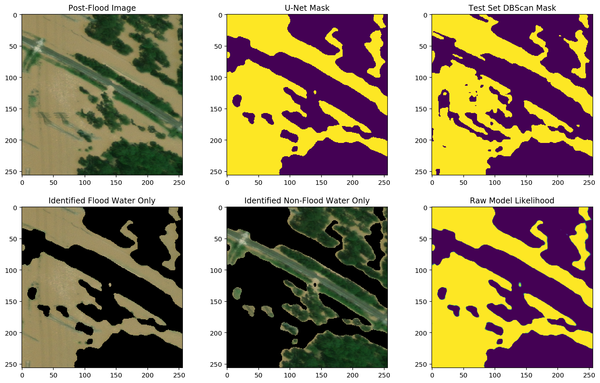
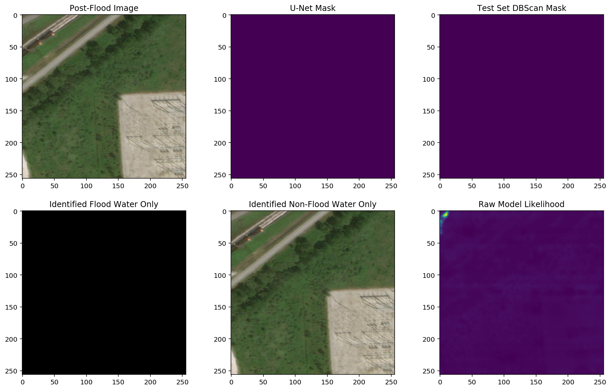

# Flood Water Detection 
### *with A Semi-Supervised U-Net*

*[UPDATE: added example image of model prediction in Puerto Rico]

This repo contains a series of notebooks which made up the core steps of a 3.5-week project I recently conducted (and presented) at Metis SF in collaboration with DigitalGlobe.  You can find my [presentation slides here](https://docs.google.com/presentation/d/e/2PACX-1vQL4lvBRuwTnkPMcWgemC2gNoN51SNeYtfwQ4IiaP9jh20XWwRdVU7EMRi4_Et_-0ukVCt8l6Ogbp1K/pub?start=false&loop=false&delayms=3000) or you can read on for a more detailed description of the project.  It is also likely that I will be continuing to work on this project here and there, so check back to see if I have added anything.

## Background:
This project was started as part of the [Metis/DigitalGlobe Data Challenge](http://deepcore.io/2017/06/06/Metis_Project.html) but, when DigitalGlobe released a substanial dataset of the areas just hit by Hurricane Harvey (through it's [Open Data Program](https://www.digitalglobe.com/opendata)) the project quickly evolved into something more immediately relevent, but utilizing a dataset in a less clean state than the SpaceNet dataset I had been planning on working with.  

## Goal:  
A goal was set to built a model which (once trained) could quickly examine satillite imagry of an area, and create a 'mask' labeling each pixel as either flooded or not (actually it assigns a likelihood of being flooded to each pixel, and a cutoff threshold is set, say P>0.50).  This is an [image segmentation](https://en.wikipedia.org/wiki/Image_segmentation) problem, more specifically **semantic segmentation** where the goal is to identify all of a partilar class.  Though it is unusal in that both a before and after picture of the area will be fed to the model, to help label/segment the post-flood image.

Additionally, to be useful the model will really need to be able to predict over a wide area to be able to generate the type of large-scale flood extent maps which would be useful to disaster response or recovery efforts.

## Image Data
The post-storm satillite images I used for this project were primarily taken on October 31st, 2017 and can be found on DigitalGlobe's Open Data Program page for [Hurricane Harvey](https://www.digitalglobe.com/opendata/hurricane-harvey/post-event).  As time has progressed more images have been added to the website, so what is there now is significantly more than what was available when I started; though the first images released were also amoung the best.  Each .geotiff file is 1.2 Gb in size, covers an area roughly 10x10km, are 20000x20000 pixels across in uncompressed 8-bit 3-color (Digital Globe internally uses Multispectral 8-band images, but those are rarely released to the public).  Many of the files are incomplete along the edges of the imaged area, because they represent subset of a much larger swath of the earth which Digital globe has corrected for perspective (affine transformation) before release to make it easier to work with.

## Building a Training Set
### Problem:  No Labeled Training Data!

The closest thing to a set of "ground truth" labels for the Houston Area post-flooding was a RADARSAT-2 (radar) difference map flagging the areas most changed after the storm (see below).  Unfortunately, the resolution of this map is several times lower than the DigitalGlobe data, and more importantly it has quite a large number of false positives (such as construction sites, deforestation, large warehouses, etc. where there was a lot of change in ground-cover) and missed many areas of flooding a well.

Unfortunately, this map is not sufficiently accurate or precise to use to train my segmentation model (see examples below).  But it would allow me to restrict a search for flooded ground imagery to a much smaller subset of the imaged area (about 1/30th of the whole DigitalGlobe set, and the majority of this subset were indeed flooded).

### Solution:  Unsupervised clustering of image pixels with Human cluster verification/adjustment
#### A.K.A. Semi-Supervised Learning

Due to the relatively uniform appearance of floodwater, the potential existed for using unsupervised segmentation/clustering techniques to identify flooded pixels in an image.  I choose DBScan has my clustering algorithm of choice.  This is because it is not biased towards any particular number of clusters (which is important as the images vary from nearly featureless floodwater, to highly complex urban landscapes), and I could tune it by setting a distance in color-space, and even bring in pixel location as a feature of I wished.

The unsupervised DBScan model works very well when an image is mostly flooded, and all the floodwater is roughtly the same color.  The tricky part is when there are multiple colors of floodwater near eachother, and when non-water objects are present with similar colors to the flooding.  A routine was written to examine color ratios and select the most common cluster which wasn't too white/grey/black or too dark green.  Unfortunately, this type of simple algorithm isn't smart enough to avoid labeling dead grass, rooftops, dirty roads, and many other surfaces as flooded if they happen to be a bit close to the color of Texas floodwater (and thanks to using local minerals for roofing tiles, many of them are), it is also not smart enough to know if there are multiple colors of floodwater in the same image.

**The solution to this problem I devised was to have a human being supervise the clustering algorithm**, and select the correct clusters manually when the algorithim didn't get it right.  I wrote a Jupyter notebook (step 03) specifically for the review of DBScan clustering, and the selection of new clusters as needed (about half the time).  Approximately 2000 flooding candiate tiles were labeled this way, about 60% of which we were able to get a good usable "ground truth" mask from (including ~10% tiles with no apparent flooding).  The rest contained clouds, poor clustering (such as selecting rooftops as floodwater), had extensive construction, or someother issue with the image quality.  Here's a couple of nice examples of manually selected clusters:

Images can now be labeled at a rate of approximately 200 per hour.  The resulting masks are highly accurate (the lack of true ground-truth for comparison prevents me to quantifyting their precision, but here are a few examples of the process so you can judge for yourself:

 

Images where the DBSCAN clustering did a poor job are rejected for (possible) revision later.

## U-Net Model

While not the only possibility for Deep Learning Semantic Segmentation, a U-Net was selected as they are known to be good at image detection and segmentation problems, and train relatively quickly.  Unlike many image classification problems, transfer learning is not really an option here as we are dealing with two image timeframes as input, and I would like the freedom to do some feature engineering to reduce the affect of shadows, etc or the eventual possibilty of adding in altitude maps, etc.  

After some experimentation with different data standardizations and model features the U-Net model is working well.  Quite often the model predictions look better than the verified DBScan 'ground truth' masks, but there are still a few areas where the model has trouble; primarily in areas with less common flooding appearances.  I believe this is due to there being less goog example of these types to train on (very dark blue/grey flood water, near certain types of buildings, etc.).  To improve, the model will need more examples of these types to train on, unban environments were of course much less common to be found flooded, and are more difficult for unsupervised labeling, so they are unfortunately underrepresented in the training set at this time.

- AUC = 0.942
- F1/Dice Score = 0.89
- Accuracy: 0.83  (random chance yields 0.36)
  * *note, again, these scores must be taken with with severals grains of salt, as the it is only relative to the training data I fed the model, which was not perfect.  A perfectly segmented image would not score very much higher, or possibly worse, because of flaws in the training data the measurements are taken against.  I am merely including them for completeness.*

## Example Model Output

Here are several examples of post-Harvey imagery, and the resulting model prediction of the area.  These are all images from the 'test' side of the 80/20 train/test split:

    

    

    

## Wide-field Prediction
Lastly, in order to achieve the goal of predicting over a wide area, I made a routine which takes a full 10km^2 DigitalGlobe footprint file (pair actually, before and after), slices it into 512x512 pixel tiles, predicts on each of those tiles, and then stitches the results back together into a single 0 to 1 likelihood mosaic of the entire area.  If you take likelihood values over some threshold (say 0.50) to be considered flooded, then you have a pixel-level labeling of the entire large-scale footprint.  

Here is a collection of wide-field predictions.  Most are not at full resolution because the files would be excessively large and the animated .gif creator I am using can't handle resolutions that high.

This next one is particularly interesting to me because you can see the 'ghost of the past' in the areas with no post-hurricane imagery, but there was pre-hurricane imagery.  They are evidence that the U-Net model is not just using the post-hurriane images, but also takes the pre-hurricane condidtions into account.

-------------------------------------------------------------------------------------------------------------
## Predict in Puerto Rico:
Hurricane Maria did a lot of damage to Puerto Rico not long after Hurricane Harvey hit, some of that damage includes flooding, primarily near the center of the island.  Unfortunately Digital Globe did not happen to image those areas, but I was able to find a small patch of flooding along the coast east of San Juan.  The image below is that region.  The fit is quite good despite being in a different region than the training set.  It remains to be seen how well the model would preform in a region with significantly different geology or climate.

## Possible Next Steps

- Re-balance or suppliment the training data set to overweigh examples of uncommon and high importance flooding appearances
- I would love to pull in another dataset as a feature: perhaps elevation, soil porosity, etc.
- Predict/test on flooding outside of Texas [UPDATE, see above for one example]
- Subtract known water bodies from model predictions (using Open Street Maps or another source for ground-truth)
- Continue labeling more training data
- Get true per-pixel labeling done (at least on a subset of images)
  * would require additional software/training, or employing a professional photoshop artist, would be expenive and/or time consuming
- Impliment a full Active Learning scheme where the model's less confident predictions are scrutenized by a human and a new training example generated if the model got an area wrong.
- Turn model output from pixel labels into geospacial polygons, allowing overlay on even wider scales or by lat/longitude 
- Make prediction maps and imagery searchable by lat/longitude (or by street address via GoogleMaps API).

### You can also see more on this project on my [personal Blog](https://lichtphyz.github.io/), and soon a the DigitalGlobe Company Blog and possibly elsewhere!

